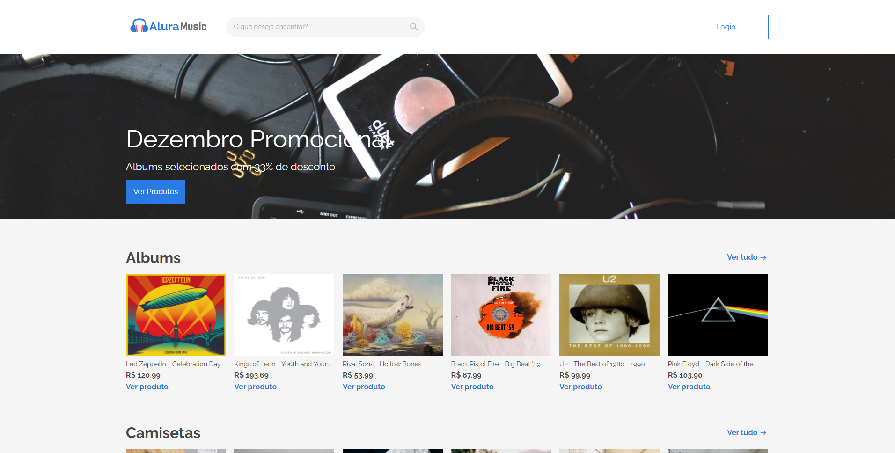
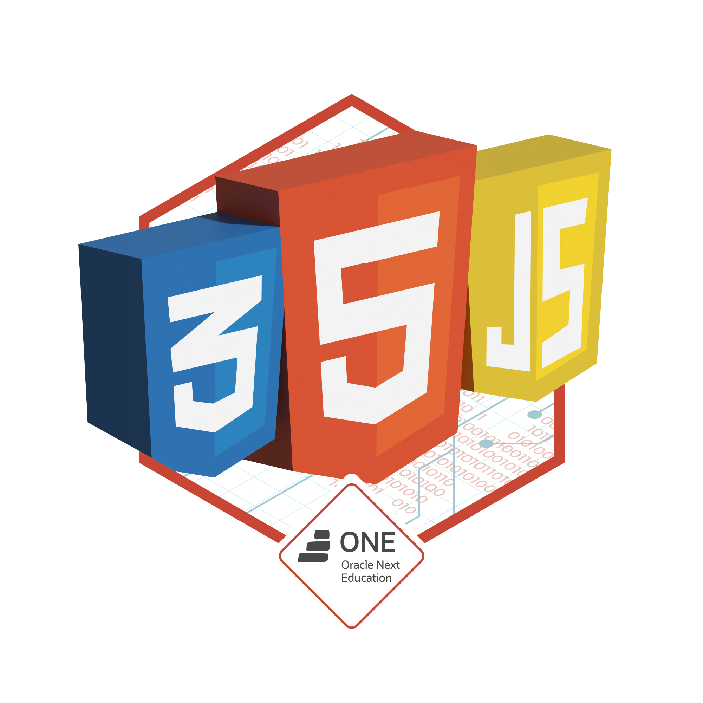

# Segundo Challenge de Front-end Oracle ONE + Alura Challenges :notes:
[English Version](#englishVersion)

> Teste a aplicação clicando na imagem

O novo projeto proposto pela Alura Challenges desta vez consistiu em um site de eCommerce, originalmente chamado Alura Geek, mas modificado por mim para o Alura Music. 

Nesse projeto tivemos a divisão em 2 Sprints:
- a <strong>1° sprint</strong> focada na construção da parte visual da aplicação em HTML5 e CSS3;
- a <strong>2° sprint</strong> com a implementação das funcionalidades de ler, adicionar, editar e excluir produtos (CRUD) e a geração do nosso conteúdo de forma dinâmica com JavaScript.

> O uso de <strong>Framework</strong> não foi requisitado para o auxílio da construção da aplicação.

### Aplicação

Você pode testar a aplicação acessando este link: 
- <a href="https://rafaeldasilvaperes.github.io/Segundo-Challenge-FrontEnd-OracleONE-Alura/" target="_blank"><strong>Alura Music ♫</strong></a> (GitHub Pages)

A aplicação é responsiva para <strong>mobile</strong>, <strong>tablet</strong> e <strong>desktop</strong>

### Persistência de dados

A persistência de dados na aplicação está sendo feita por uma API desenvolvida em NodeJS por mim. Os dados estão sendo salvos em um banco de dados NoSQL o MongoDB na núvem com o uso do [MongoDB Atlas](https://www.mongodb.com/pt-br/cloud/atlas/efficiency). Você pode visitar o repositório da API que consumo por esse front-end através deste link:

- <a href="https://github.com/Rafaeldasilvaperes/Alura-Music-API-in-nodejsExpress" target="_blank"><strong>Alura Music API in NodeJsExpress</strong></a> (repositório)

## Alura Music ♫

#### Novo Usuário

Caso queira testar as funcionalidades de adicionar, editar, excluir da aplicação, será necessário criar um novo usuário. Basta acesar o botão "Cadastrar" e entrar com um novo e-mail ainda não cadastrado, senha e a confirmação da senha. 

A autorização dos usuários dentro da aplicação não possuí estado, você receberá um token JWT que será usado para gerir a autorização durante o uso da aplicação. Esse token será enviado a cada requisição ao servidor. 

### POST - Criar novo produto

Os produtos possuem alguns atributos necessários:
- Imagem: todas imagens serão convertidas em uma string base64 antes de serem enviadas ao servidor;
- Nome: alfanumérico e com limite de 100 caracteres;
- Categoria: são três e ajudam a gerir a exibição dos produtos dentro da aplicação:
  - Albums
  - Camisetas
  - Ilustrações
- Preço: foi usado a mascara Simple Mask Money para padronizar as entradas no campo;
- Descrição da Imagem: consiste em um item para acessibilidade que será usado no atributo "alt" da imagem e é obrigatório;
- Descrição: adicione aqui a descrição do seu produto com atributos e funcionalidades que descrevem todos possíveis atributos de interesse ao público.

## Tecnologias :gear:

Foi disponibilizado um <strong>Wireframe</strong> no <strong>Figma</strong> pelo pessoal da Alura Challenges para que fosse usado como base. Tentei manter todas as proporções de acordo com o Design do Projeto. Tomei a liberdade de fazer algumas mudanças chaves na aplicação para obter a expressão de um tema relacionado a música, mas nenhuma mudança na identidade ou na estrutura do design do projeto foram feitas. 

Devido a falta de uma página de exibição de <strong>Todos os Produtos Pública</strong> no Design disponibilizado, construí uma nova página tentando manter a mesma identidade visual do resto da aplicação.

Você pode visualizar o Wireframe proposto através do link:

## Bedge de Entrega :heavy_check_mark:

